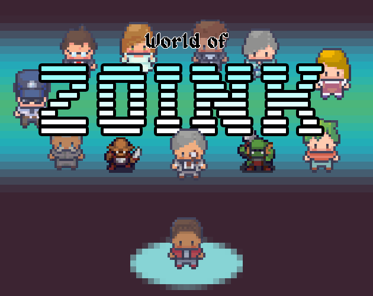

# World of Zoink

This is the public-facing repository for *World of Zoink*, a satirical RPG-puzzle game for the Game Boy Advance, and my submission for [GBA Jam 2024](https://itch.io/jam/gbajam24). To play, check out [the game's Itch.io page](https://colonelsalt.itch.io/zoink).

This repo has been stripped of all 3rd party asset files that I do not have permission to redistribute. These assets are still embedded in the code in minimised binary form, so the game can still be built, but original image, audio, and [Tiled](https://www.mapeditor.org/) map files are not available.

The game was built from scratch in C++ over the course of the jam (May-August 2024), using the following two libraries (included as part of devkitPro's GBA development package):
- [Libtonc](https://github.com/devkitPro/libtonc/tree/master)
- [Maxmod](https://github.com/devkitPro/maxmod)

For asset credits, visit [the game's Itch page](https://colonelsalt.itch.io/zoink), or `credits.txt`. Custom 3rd party asset licences are also included in the `licences` folder.
## Building

Follow the instructions for installing the devkitARM compiler on the [devkitPro getting started page](https://devkitpro.org/wiki/Getting_Started), making sure to install the 'gba-dev' package in the process.

From there, build with `make` to produce `zoink.gba`.